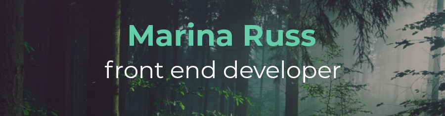

<h1 align="center">👋 It's nice to meet you!</h1>

I'm a front-end developer currently learning full stack development through MSU's Code Bootcamp. My goal is to create sites and apps that are both functional and beautiful to maximize the user's experience. I'm passionate about CSS3 and excited about the possibilities with APIs! I love how the tech world is constantly revolving, opening up newer and more efficient ways to problem solve every day!

  

📄 Portfolio: [marina-russ.github.io/](https://marina-russ.github.io/)

## 🧙‍♀️  About Me:
- 🕹️ Hobbies: 🎮 Gaming, 📚 Reading, 🎧 Music, 🎨 Graphic Design
- 😄 Pronouns: she/her
- 🍁 Speaks: English, French Canadian
- ✍️ Fun fact: I'm left-handed 

## 🖥️ Code: 

### Languages:    

### Databases:  

### Frameworks:     

### Tools:     

### Design:   

        

#### 💡 Future:
- 🌱 Currently Learning: 
- ❗ Excited To Learn: 

### 🏷️ Badges:
 
